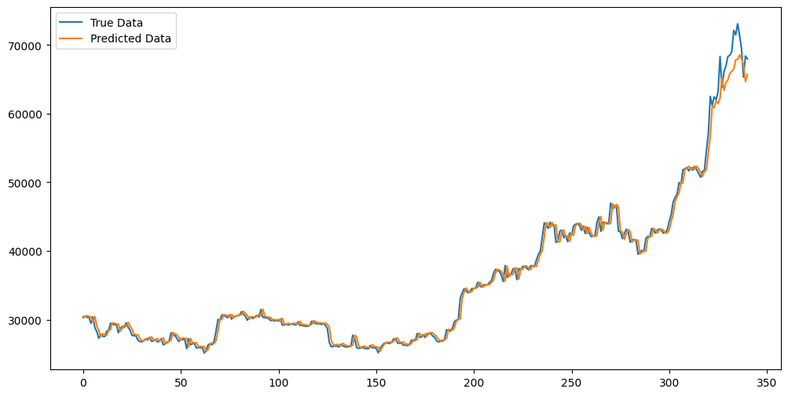
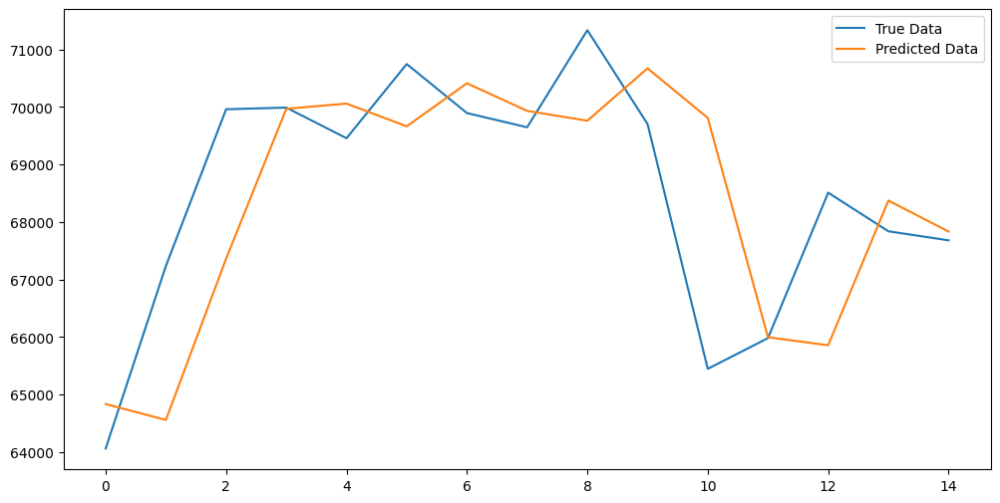

# Bitcoin Price Prediction

A deep learning project for predicting Bitcoin price.

## Project Overview

This project aims to utilize historical Bitcoin price data to predict future prices using deep learning techniques. It is intended as an educational exercise to demonstrate how data science can be applied to financial datasets, and is not meant for actual trading or investment purposes.

## LSTM Model Features

- **Sequence Processing**: LSTMs are designed to process sequences of data, making them ideal for time series like stock prices.
- **Long-term Dependency Learning**: They can remember information over long periods, which is critical for capturing the trends in price movements.
- **Gated Cells**: Utilizes gates to control the flow of information, which helps in reducing issues like vanishing and exploding gradients.
- **Flexibility**: LSTMs can be used for various tasks like one-to-one, one-to-many, many-to-one, and many-to-many predictions, catering to different prediction requirements.
  
## Results

### Prediction on Test Data

This chart represents the model's prediction performance on the test data. The blue line indicates the true Bitcoin prices, while the orange line shows the predicted prices.

### Prediction on New Data (Past 14 Days)

Here we have the model's predictions on new data from the past 14 days. The comparison between the actual prices (blue) and predicted prices (orange) showcases the model's real-time predictive capability.

## Features

- **Data Preprocessing**: Cleansing and preparation of historical Bitcoin price data.
- **Exploratory Data Analysis (EDA)**: Visualization and analysis to understand the data better.
- **Training and Testing**: Splitting the data into training and testing sets to train our model and evaluate its performance.
- **Prediction**: Using the trained model to predict future Bitcoin prices.

## Technologies Used

- Python: The main programming language used for the project.
- Pandas & NumPy: For data manipulation and numerical calculations.
- Matplotlib: For data visualization.
- Scikit-learn: For machine learning model development.

## How to Run

To get started with the Bitcoin Price Prediction model, you can either utilize the pre-trained weights provided or train the model with your own dataset. The training script (`train.py`) is flexible and accepts various types of time-series data, so feel free to experiment with other cryptocurrencies or stock market data.

To execute the model:

1. **Set up your environment**

Ensure that you have a Python environment with all the required dependencies installed.

2. **Prepare your dataset**

Load your dataset into the `train.py` script, ensuring it is in a compatible format. The script is configured to handle time-series data, so other financial datasets can be used as well.

3. **Train or load the model**

Train the model using your dataset, or load the pre-existing weights if you prefer not to train:

4. **Run predictions**

With the model trained or the weights loaded, you can proceed to make predictions by running the `main.py` script:

Please ensure that the data provided to `main.py` for predictions is preprocessed similarly to the training data.

## Contributing

Contributions are welcome! Please feel free to submit a pull request or open an issue.
